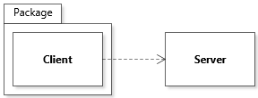

# JetUML File Format

JetUML uses an open file format to store diagram information. This means that anyone can:
* Programmatically generate UML diagram files and open them in JetUML, or
* Read and manipulate diagram files outside of JetUML.

JetUML stores diagrams in JSON notation using a format specified using [JSONSchema](https://json-schema.org/) Version 2020-12. There is one format for each diagram type. These formats follow the same design and only vary in the types of nodes and edges involved.

## Schemas

The schemas can be used to interpret and [validate](https://json-schema.org/implementations.html#validators) diagram files outside of JetUML.

* [Class Diagram](schema/3.0/class.schema.json) (`.class.jet`)
* [Object Diagram](schema/3.0/objectschema.json) (`.object.jet`)
* [Sequence Diagram](schema/3.0/sequence.schema.json) (`.sequence.jet`)
* [State Diagram](schema/3.0/state.schema.json) (`.state.jet`)
* [Use Case Diagram](schema/3.0/usecase.schema.json) (`.usecase.jet`)

## Diagram Validation in JetUML

JetUML performs three types of validation when loading a diagram file:
1. **Syntactic:** If the file does not contain well-formed JSON notation, a _syntactic error_ will be reported;
2. **Structural:** If the JSON file can be read but the information it contains cannot be assembled into a diagram, a _structural error_ will be reported. An example of structural error is trying to add a node of an invalid type to a diagram (for example, a state transition edge to a class diagram). Most, but not all, structural errors would be detected by validating a file against the suitable schema.
3. **Semantic:** JetUML only renders diagrams that respect a set of semantic diagramming rules. If a diagram file can be loaded and converted to a diagram, but this diagram violates one or more semantic rules, a _semantic error_ will be reported. An example of semantic error is a self-generalization (i.e., a class that generalizes itself). JetUML diagrams must be semantically valid to be rendered because the rendering requires some semantic properties to hold.

## File Format History

Schemas are distinguished using the first JetUML release that used a given format. The current schema version is 3.0, meaning that diagram files created by any version of JetUML since 3.0 (inclusive) use the same format. Diagrams created with versions 2.1-2.6 can be upgraded automatically by loading them using JetUML 3.5, which included an automatic version migrator. This migrator was retired for version 3.6. 

## A Simple Example

This class diagram has the following encoding.



```json
{
    "diagram": "ClassDiagram",
    "version": "3.5",
```
Each diagram file has four required attributes: `diagram`, `version`, `nodes`, `edges`. The values allowed for `diagram` are encoded in the enumerated values of type `DiagramType`.

```json
    "nodes": [
        {
            "x": 430,
            "y": 190,
            "id": 1,
            "type": "ClassNode",
            "name": "Client",
            "attributes": "",
            "methods": ""
        },
```
The attribute `nodes` is an array of objects, each representing a node in a UML diagram. All nodes must have the attributes `x`, `y`, `id`, and `type`. The values for `x` and `y` are the position of the node's top-left corner on the canvas (coordinates increase going right and down). The `id` node is an arbitrary integer used for internal reference. This id only needs to consistently refer to the node within the diagram file. The `type` corresponds to the type of node to be loaded (see classes in `org.jetuml.diagram.nodes` for the list). The other attributes are properties of the node and depend on the node type (see method `buildProperties()` of a given node type to see its required properties and their type).
```json
        {
            "x": 600,
            "y": 190,
            "id": 2,
            "type": "ClassNode",
            "name": "Server",
            "attributes": "",
            "methods": ""
        },
        {
            "x": 420,
            "y": 160,
            "id": 0,
            "type": "PackageNode",
            "name": "Package",
            "children": [
                1
            ],
        }
    ],
```
Some nodes have _children_. The parent-child relation indicates a semantic dependency. Some nodes require a parent, and some can optionally have one. For example, a class node can both be a root node or a child node of a package node (as in this example). In contrast, a field node in an object diagram _must_ be a child of an object node. See the code of corresponding nodes for details (methods `Node#allowsAsChild` and `Node#requiresParent` specify this behavior). The parent-child relation between nodes is encoded by having the parent list the ids of all their children in the `children` array.
```json
    "edges": [
        {
            "type": "DependencyEdge",
            "start": 1,
            "end": 2,
            "middleLabel": "",
            "directionality": "Unidirectional"
        }
    ]
}
```
Edges are encoded similarly to nodes, except that they don't have a position or id. Instead, edges have a required `start` and `end` attribute. The value of these attributes is the id of the nodes that the edge links. The edge's `type` value determines the class that implements the edge (see classes in `org.jetuml.diagram.edges` for the list), and method `buildProperties()` of a given edge type will provide its required properties and their type.